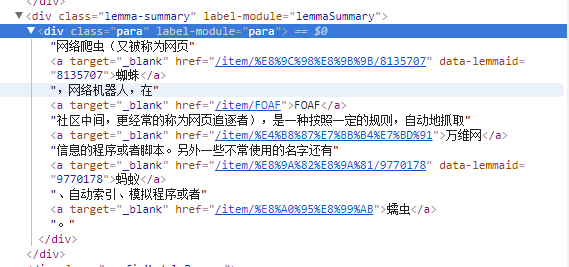

# 基础爬虫 

基础爬虫仅仅考虑功能的实现，未涉及优化和稳健性的考虑，本次项目的目的是爬取500个百度百科网络爬虫词条
以及相关词条的标题、摘要、链接等信息。</b>

* [爬虫调度器](#1)

* [URL管理器](#2)

* [HTML下载器](#3)

* [HTML解析器](#4)

* [数据存储器](#5)

* [邮件发送器](#6)

***

* 爬虫调度器(SpiderMan.py)
  
  - 该模块主要负责统筹其他五个模块的协调工作。首先要初始化各个模块，然后通过
  crawl(root_url)方法传入入口URL,方法内部实现按照运行流程控制各个模块的工作。
  
  
***

* URL管理器(UrlManager.py)
  - 该模块主要包括两个变量，一个是已爬取URL集合，另一个是未爬取URL的集合
  集合采用Python中的set类型，主要使用set的去重复功能，防止连接重复爬取
  因为爬取链接重复时容易造成死循环。（Ps:链接去重复在Python爬虫开发中必
  备的功能，解决方案主要有三种：1）内存去重 2）关系数据库去重 3）缓存数
  据库去重。大型爬虫基本上采用缓存数据库的去重方案，尽可能避免内存大小的
  限制，又比关系数据库去重性能高很多。由于基础爬虫的爬取数量较小，因此我
  们使用Python中set这个内存去重方案)
  - 该模块除了具有两个URL集合外，还需提供一下接口，用于配合其他模块使用，如下：
    1. has_new_url():判断是否有待取的URL链接
    2. add_new_url(),add_new_urls():添加新的URL链接到未爬取的集合
    3. get_new_url():获取一个未爬取的URL链接
    4. new_url_size():获取未爬取的URL集合的大小
    5. old_url_size():获取已经爬取的URL集合的大小
  
  
***

* HTML下载(HtmlDownloader.py) 
  - 该模块用来下载网页，需注意网页的编码，以保证下载的网页没有乱码，只需实现一个接口download(url)

* HTML解析器(HtmlParser.py)
  - 该模块使用BeautifulSoup进行HTML解析。需要解析的部分主要分为提取相关词条页
  面的URL和提取当前词条的标题和摘要信息。主要提供一个parser对外接口，输入参数为当前页面的URL和HTML下载器返回的内容。
  -    
  - 
  - 从上面的网页截图可以看到标题的标记位于:
  `<dd class='lemmaWgt-lemmaTitle-title'><h1></h1>`
  - 摘要文本位于：
  `
`
  - 最后再看需要抽取的URL的格式，相关词条的URL格式类似于`<a target='_blank'href='/item/...'>` text `</a>`这种形式,提取a
  标记中的href属性即可，从格式看href属性是一个相对网址，可以使用urlparse.urljoin()函数将当前网址和相对网址拼接成完成的URL路径
 (Python3中urljoin现在对应的函数是urllib.parse.urljoin)
***

* 数据存储器(DataOutput.py)
   - 该模块主要包括两个方法：
    1. store_data(data)用于将解析出来的数据存储到内存中
    2. output_html()用于将存储的数据输出为指定的文件格式，在这里，我们输出为html格式。
***

* 邮件发送器(DataOutput.py)
   - 该模块主要用于在爬取过程中出错或爬取完成时的提醒。
***
    
